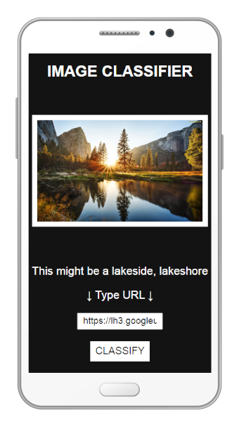

# imageClassifier-TensorFlow

> Image classifier with lib TensorFlow

## Contents

- [Technologies](#technologies)
- [Link](#link)
- [Description](#description)
- [View desktop](#view-dekstop)
- [View mobile](#view-mobile)
- [Author](#author)
- [Version](#version)
- [License](#license)

## Technologies

- HTML
- CSS
- JavaScript
- TensorFlow

## Link

[Click here](https://davidburdelak.github.io/ImageClassifier-TensorFlow/)

## Description

Image classifier with lib TensorFlow

## View desktop

## View mobile

## Author

David Burdelak

## Version

1.0.0

## License

The imageClassifier-TensorFlow is released under the
[MIT license](https://opensource.org/licenses/MIT).
